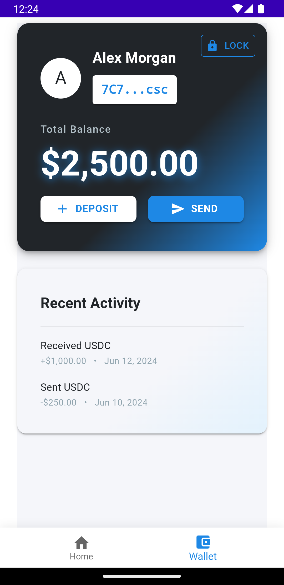
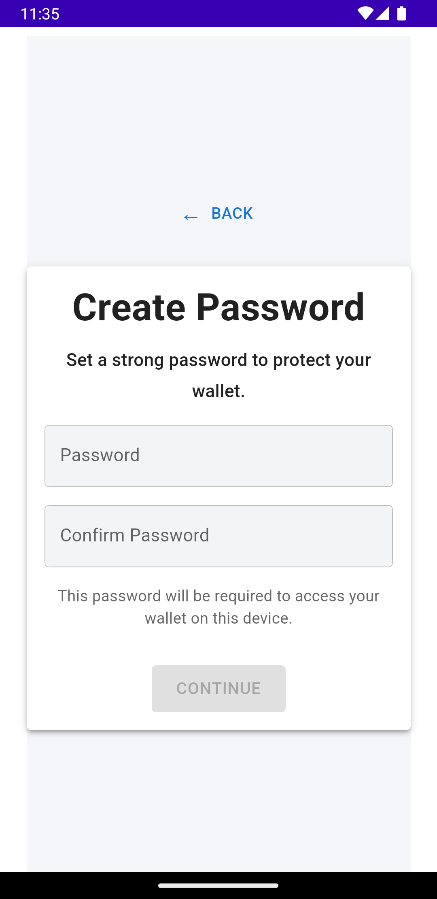
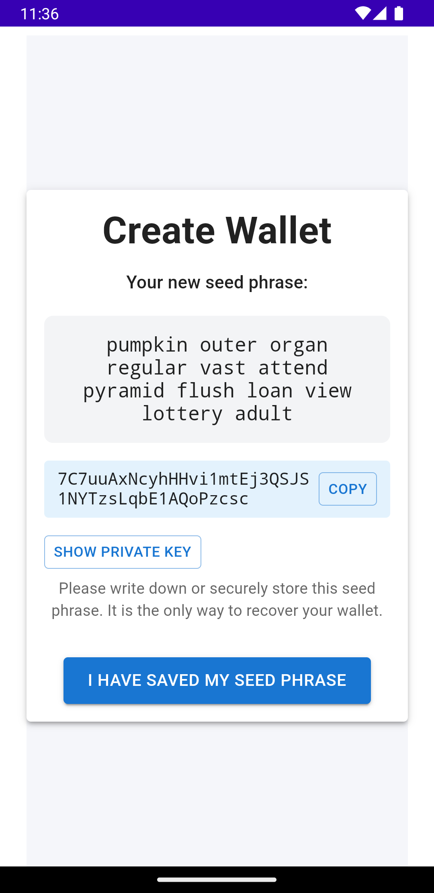

# NotWallet

Solana wallet and more. Do your own research.

**Use at your own risk.**

## Recommended IDE Setup

- [VS Code](https://code.visualstudio.com/) + [Tauri](https://marketplace.visualstudio.com/items?itemName=tauri-apps.tauri-vscode) + [rust-analyzer](https://marketplace.visualstudio.com/items?itemName=rust-lang.rust-analyzer)


## Run targets

Build desktop, iOS, and Android targets:

```bash
$ pnpm run tauri dev
$ pnpm run tauri ios init
$ pnpm run tauri ios dev
$ pnpm run tauri android init
$ pnpm run tauri android dev
```

If you want to build for iOS and Android, you enter the teritori of cross compilation. Follow Tauri guide.

- When updating tauri.conf.json, always clean up src-tauri/gen folder and init the android and ios project again.

```bash
$ pnpm run tauri android init
$ pnpm run tauri ios init
```

<details>
  <summary>Screenshots</summary>

  <p></p>
  <p></p>
  <p></p>

</details>

